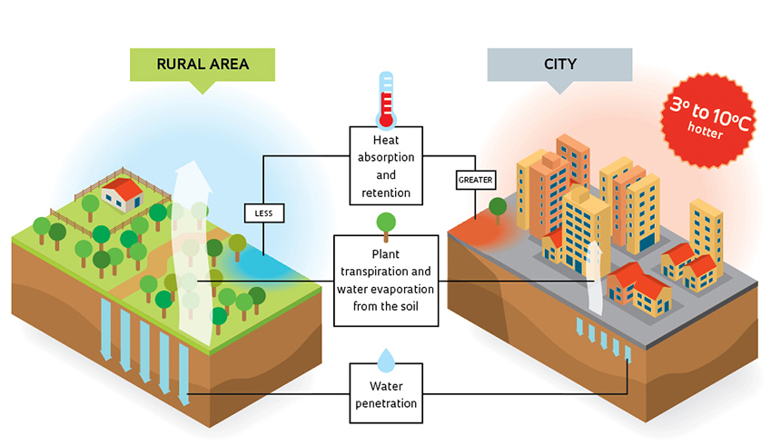

# Green-Space-Atlas
An earth observation project, utilising custom scripts to analyse the amout of urban green spaces and vegetation in the highly urbanised city of Tokyo.

3 different evalscripts were used for this, along with the satellite images gathered from Sentinel Hub. The scripts were built in-house with Sentinel Hub's API/requests builder. 

## Aim
The aim for this project is to fuse these varying visual scripts along with any other custom scripts to develop an intergrated visual story for urban planners, landscape architects and environmental planners. Knowing where green spaces and water bodies are located can offer planners, entrepreneurs and policy-makers insight into decision-making for social and environmental impact. Climate change is contributing to the urban heat-island effect, therefore protecting and safeguarding public health from heat-related illnesses and deaths is vital for large economies with very urbanised areas.

## Goal
The goal for this project is to create an app for the stakeholders mentioned above that provides realtime visualisations on green spaces, water features and soil moisture health on the city landscape, offering objective ground truths which individuals and groups can therefore act upon. 

## Machine Learning
Perhaps there could be a potential machine learning product to provide intelligent predictions for our stakeholders. This will only be considered after creating the minimum viable product.
